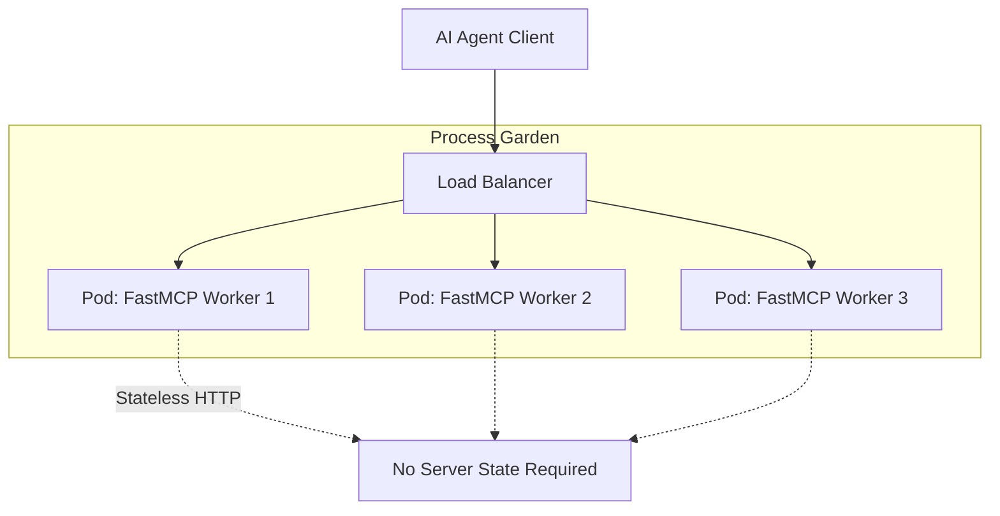

# Presentation Todo: Building Robust MCP Servers with FastMCP

## Constraints

- Target length - 10 minutes maximum.
- Target slide count: 10 slides.
- Audience assumption: Python/API developers who know HTTP APIs, but may only have a basic understanding of MCP.
- Main message: A production MCP server is an API surface for models, so architecture, schemas, auth, context, testing, and scaling matter more than decorators.
- Delivery rule: one idea per slide, one concrete example per technical point.

## Timing Plan

- 0:00-0:45: Position MCP as API design for model consumers.
- 0:45-1:45: Explain remote MCP transport through HTTP, JSON-RPC, and `/mcp`.
- 1:45-3:15: Show FastMCP app structure and secure defaults.
- 3:15-4:00: Show FastMCP mounted inside FastAPI/Starlette.
- 4:00-5:15: Explain efficient tool modeling.
- 5:15-6:15: Explain context management.
- 6:15-7:15: Cover OAuth and auth boundaries.
- 7:15-8:45: Cover scaling and high-concurrency caveats.
- 8:45-9:45: Show production checklist / evaluation loop.
- 9:45-10:00: Close with the takeaway.

## Slide Todo List

### Slide 1: Title and Promise

- [ ] Include exact title: "Building Robust MCP Servers with Python and FastMCP".
- [ ] Add subtitle: "API architecture for model consumers".
- [ ] State the promise in speaker notes: attendees will leave with a mental model and checklist for production-ready MCP servers.
- [ ] Keep visual minimal: title, name, and a simple API-to-model diagram.

### Slide 2: MCP Servers Are APIs for Models

- [ ] Core assertion: "REST → GraphQL → MCP: each step unified the interface and raised the abstraction level. The model replaces the human client."
- [ ] Tell the evolution story in three steps:
  - **REST**: many URLs, HTTP verbs carry intent, human-written clients.
  - **GraphQL**: one URL, typed operations, structured contract — closer in spirit.
  - **MCP**: one URL, JSON-RPC 2.0, model as the primary consumer.
- [ ] Demystify the transport: a remote MCP call is a plain `POST /mcp` with a JSON-RPC 2.0 body. No new protocol magic.
- [ ] Show a concrete JSON-RPC request snippet (`tools/call`) on the right column so the audience can see the wire format immediately.
- [ ] State explicitly: `/mcp` is a community convention, not a spec requirement. The endpoint path is an app decision.
- [ ] Use `two-cols` layout: evolution narrative on the left (with `v-click` reveal per bullet), JSON-RPC snippet on the right.
- [ ] Keep speaker notes focused on the framing: the only real change from REST/GraphQL is *who* is on the other end — a model, not a human client. That shift is what makes architecture matter.

### Slide 3: Make FastMCP Feel Like FastAPI/Flask

- [ ] Core assertion: "FastMCP projects should use familiar web-app structure, not one giant decorator file."
- [ ] Introduce the app factory pattern:

```python
def create_app(auth: AuthProvider) -> FastMCP:
    app = FastMCP(
        name="production-server",
        auth=auth,
        mask_error_details=True,
        on_duplicate="error",
    )
    app.apply_middleware(correlate.McpRequestCorrelationMiddleware())
    register_tools(app)
    register_resources(app)
    return app
```

- [ ] Mention version caveat in speaker notes: some FastMCP versions expose specific duplicate settings such as `on_duplicate_tools`, `on_duplicate_resources`, and `on_duplicate_prompts`; current docs also describe global `on_duplicate`.
- [ ] Explain what belongs in the app factory:
  - Register tools, resources, prompts, and middleware.
  - Configure auth and security-sensitive server behavior.
  - Wire clients, repositories, feature flags, and settings.
  - Keep import-time side effects out of modules.
- [ ] Call out request correlation middleware as an example of production wiring:

```python
app.apply_middleware(correlate.McpRequestCorrelationMiddleware())
```

- [ ] Speaker note: use middleware for cross-cutting concerns such as correlation IDs, tracing, logging, rate limiting, and policy checks rather than repeating them inside tools.
- [ ] Emphasize dependency inversion: pass configuration and objects the server depends on as arguments.
- [ ] Call out test value: tests can create isolated app instances with fake clients and development auth.
- [ ] Explain `mask_error_details=True`: unmasked Python errors can expose secrets, confidential data, stack details, or implementation internals to the client LLM.
- [ ] Explain `on_duplicate="error"`: duplicate component registration should fail during startup instead of silently replacing tools, resources, or prompts.
- [ ] Include development auth example as speaker-note material, not full slide text:

```python
verifier = StaticTokenVerifier(
    tokens={
        "dev-alice-token": {
            "client_id": "alice@company.com",
            "scopes": ["read:data", "write:data", "admin:users"],
        },
        "dev-guest-token": {
            "client_id": "guest-user",
            "scopes": ["read:data"],
        },
    },
    required_scopes=["read:data"],
)
```

- [ ] Speaker note: clients can authenticate with `Authorization: Bearer dev-alice-token`, letting local development and tests exercise authorization decisions without mocking remote OAuth services.

### Slide 4: Mount FastMCP Like Any ASGI Sub-App

- [ ] Core assertion: "The FastAPI app should have its own factory too; mounting MCP is infrastructure wiring."
- [ ] Show this shape:

```python
def create_app(
    fastmcp_app: FastMCP,
    lifespan: Lifespan[FastAPI],
    mount_prefix: str = "",
    mcp_path: str = "/mcp",
) -> FastAPI:
    http_app = fastmcp_app.http_app(path=mcp_path, stateless_http=True)
    fastapi_app = FastAPI(lifespan=combine_lifespans(lifespan, http_app.lifespan))
    fastapi_app.mount(mount_prefix, http_app)
    return fastapi_app
```

- [ ] Speaker note: choose `mount_prefix` and `mcp_path` deliberately so the public MCP endpoint is what you expect; avoid accidentally creating `/mcp/mcp`.
- [ ] Explain `stateless_http=True`: each request gets a fresh transport context, avoiding session affinity requirements in horizontally scaled deployments. This is exactly what enables a scalable process garden setup.
- [ ] Include this Mermaid diagram to visualize the "process garden" load-balancing architecture enabled by stateless HTTP:



- [ ] Explain that `mcp.http_app()` returns a Starlette app with a lifespan hook.
- [ ] Include the implementation detail:

```python
class StarletteWithLifespan(Starlette):
    @property
    def lifespan(self) -> Lifespan[Starlette]:
        return self.router.lifespan_context
```

- [ ] Include the authenticated mounting caveat: expose MCP Authorization protocol discovery routes on the upstream FastAPI app when needed.

```python
router = fastapi.APIRouter(
    routes=list(fastmcp_app.auth.get_well_known_routes(mcp_path="/mcp"))
)
fastapi_app.include_router(router)
```

- [ ] Explain why this matters: protected resource metadata discovery and authorization server metadata discovery rely on `.well-known` routes.
- [ ] Speaker note: the `mcp_path` passed to `get_well_known_routes()` must match the public MCP endpoint used by clients.
- [ ] Call out the lifespan rule: if the upstream FastAPI app already has startup/shutdown work, use `combine_lifespans`; do not drop `http_app.lifespan`.
- [ ] Speaker note: missing the MCP lifespan can leave the Streamable HTTP session manager uninitialized.
- [ ] Use the slide to make one point: FastMCP integrates with normal ASGI architecture, so deployment, lifespan, auth discovery, observability, and middleware need deliberate web-app wiring.

### Slide 5: Separate Tool Definitions From Registration

- [ ] Core assertion: "Aggregate tools at the app level from the app's modules."
- [ ] Show the tactical pattern: each module defines its tool functions, the app imports and aggregates them, then registers them with `Tool.from_function(...)` and `app.add_tool(...)`.
- [ ] State the dependency direction explicitly: feature modules should not import the FastMCP app; the app imports feature modules.
- [ ] Include this example snippet:

```python
# customers/tools.py
from fastmcp.dependencies import Depends


async def search_customers(
    query: CustomerSearchQuery,
    service: CustomerService = Depends(get_customer_service),
) -> CustomerSearchResult:
    return await service.search(query)


# mcp_app/tools.py
from fastmcp.tools import Tool
from customers.tools import search_customers


def register_tools(app: FastMCP) -> None:
    app.add_tool(Tool.from_function(search_customers))
```

- [ ] Explain why this is better than decorating everything at definition time:
  - Tool definitions stay close to their domain code.
  - Feature modules do not depend on the FastMCP app instance.
  - Dependencies are declared with `Depends(...)` without wiring the app into the feature module.
  - Dependency parameters are resolved by FastMCP and excluded from the client-visible MCP schema.
  - The FastMCP app factory becomes the composition root.
  - Registration order and duplicate failures are visible in one place.
  - Tests can exercise the function directly or the registered MCP tool.
- [ ] Speaker note: decorators are fine for small demos; `from_function` plus `add_tool` scales better when tools are spread across modules and packages.
- [ ] Transition: once registration is explicit, the next concern is modeling the tool contract clearly.

### Slide 6: Use Pydantic at the Tool Boundary

- [ ] Core assertion: "Tool input and output models are the contract the model sees."
- [ ] Show a create-customer example with constrained input fields, extra types, dependency injection, and explicit output validation:

```python
from typing import Annotated, Literal

from fastmcp.dependencies import Depends
from pydantic import AfterValidator, BaseModel, ConfigDict, EmailStr, Field
from pydantic_extra_types.country import CountryAlpha2
from pydantic_extra_types.currency_code import Currency
from pydantic_extra_types.language_code import LanguageAlpha2
from pydantic_extra_types.timezone_name import TimeZoneName


def format_customer_id(value: str) -> str:
    digits = "".join(ch for ch in value if ch.isdigit())
    if len(digits) != 6:
        raise ValueError("customer_id must contain 6 digits")
    return f"CUS-{digits[:3]}-{digits[3:]}"


CustomerId = Annotated[
    str,
    Field(description="Customer ID formatted as CUS-123-456"),
    AfterValidator(format_customer_id),
]


class CreateCustomerInput(BaseModel):
    model_config = ConfigDict(frozen=True, extra="forbid", str_strip_whitespace=True)

    email: EmailStr
    display_name: Annotated[str, Field(min_length=2, max_length=80)]
    country: CountryAlpha2
    preferred_currency: Currency
    preferred_language: LanguageAlpha2 = "en"
    timezone: TimeZoneName


class CustomerCreated(BaseModel):
    model_config = ConfigDict(frozen=True, extra="forbid", from_attributes=True)

    customer_id: CustomerId
    email: EmailStr
    display_name: str
    country: CountryAlpha2
    preferred_currency: Currency
    status: Literal["active"]


async def create_customer(
    input: CreateCustomerInput,
    service: CustomerService = Depends(get_customer_service),
) -> CustomerCreated:
    dto = await service.create_customer(input)
    return CustomerCreated.model_validate(dto, from_attributes=True)
```

- [ ] Explain input-side value:
  - `EmailStr`, `CountryAlpha2`, `Currency`, `LanguageAlpha2`, and `TimeZoneName` give the model a tighter schema than plain strings.
  - `Annotated[..., Field(...)]` makes constraints and descriptions visible in generated schemas.
  - `ConfigDict(frozen=True, extra="forbid")` prevents accidental mutation and rejects unknown fields.
- [ ] Explain output-side value:
  - Return type annotations let FastMCP generate an output schema for structured results.
  - `CustomerCreated.model_validate(dto, from_attributes=True)` validates service-layer data before FastMCP serializes it.
  - The server owns output validation failures instead of discovering them only as client-visible tool errors.
- [ ] Speaker note: if the tool returns a DTO directly and output validation fails inside FastMCP, the model may only see a `ToolError` with validation details; without explicit validation/logging at the tool boundary, server-side debugging and observability are weaker.
- [ ] Keep the design point: tools should be small, typed, evaluable operations with compact predictable output schemas.
- [ ] Mention that tool descriptions, field descriptions, constraints, and return schemas are part of the public API contract.

### Slide 7: Centralize Tool Error Conversion

- [ ] Core assertion: "With masked errors enabled, expected domain failures must be converted to intentional `ToolError`s."
- [ ] Explain the FastMCP gap: unlike FastAPI's `app.exception_handler(CustomError)`, FastMCP does not provide an app-level exception handler hook for tool exceptions.
- [ ] Show a context-manager pattern that keeps conversion local but reusable:

```python
import contextlib
import hashlib

import attrs
from fastmcp.exceptions import ToolError
from loguru import logger
from pydantic import EmailStr


@attrs.frozen
class DuplicateCustomerEmailError(Exception):
    email: EmailStr


def hash_email(email: EmailStr) -> str:
    return hashlib.sha256(str(email).encode()).hexdigest()[:12]


@contextlib.contextmanager
def map_tool_errors():
    try:
        yield
    except DuplicateCustomerEmailError as duplicate_email_error:
        with logger.contextualize(email_hash=hash_email(duplicate_email_error.email)):
            logger.exception("Duplicate customer email")
        raise ToolError(
            "A customer with this email already exists."
        ) from duplicate_email_error
    except Exception as unexpected_error:
        logger.exception("Unexpected tool error")
        raise ToolError("Unknown error occurred.") from unexpected_error


async def create_customer(
    input: CreateCustomerInput,
    service: CustomerService = Depends(get_customer_service),
) -> CustomerCreated:
    with map_tool_errors():
        dto = await service.create_customer(input)
        return CustomerCreated.model_validate(dto, from_attributes=True)
```

- [ ] Explain why this pattern matters:
  - `mask_error_details=True` prevents accidental leakage, but generic masked errors are not enough for expected business failures.
  - Domain errors can become safe, model-actionable `ToolError` messages.
  - Logs still keep structured context for debugging and alerting.
  - Generic exceptions are logged and converted to one safe fallback message.
- [ ] Speaker note: for larger servers, this can evolve into a registry or `functools.singledispatch` mapper, effectively implementing your own `fastmcp_app.error_handler(...)` pattern.
- [ ] Speaker note: this is a real development-experience gap between FastMCP and FastAPI; FastAPI gives a first-class exception-handler surface, while FastMCP currently pushes this into app patterns.

### Slide 8: Use a Composition Root for Dependencies

- [ ] Core assertion: "FastMCP `Depends` is useful, but it is not a full dependency inversion mechanism by itself."
- [ ] Contrast with FastAPI: FastAPI has `app.dependency_overrides` for tests; FastMCP does not currently have an equivalent direct override surface.
- [ ] Introduce `svcs` as a small external dependency container.

```python
from fastmcp.dependencies import Depends
import svcs


async def get_customer_service(
    svcs_container: svcs.Container = Depends(get_svcs_container),
) -> CustomerService:
    return await svcs_container.aget(CustomerService)


async def create_customer(
    input: CreateCustomerInput,
    service: CustomerService = Depends(get_customer_service),
) -> CustomerCreated:
    with map_tool_errors():
        dto = await service.create_customer(input)
        return CustomerCreated.model_validate(dto, from_attributes=True)
```

Tests:

```python
import pytest
import fastmcp
import svcs


async def test_create_customer_uses_fake_service(
    mcp_client: fastmcp.Client,
    registry: svcs.Registry,
) -> None:
    fake_service = FakeCustomerService(customer_id="CUS-123-456")
    registry.register_value(CustomerService, fake_service)

    result = await mcp_client.call_tool(
        "create_customer",
        {"email": "alice@example.com", "display_name": "Alice"},
    )

    assert result.structured_content["customer_id"] == "CUS-123-456"
    assert fake_service.created_customers[0].email == "alice@example.com"
```

### Slide 9: Beyond 1:1 API Mapping (Workflow-First Design)

- [ ] Core assertion: "Mapping every REST endpoint 1:1 to an MCP tool creates cognitive overload. Design top-down from user workflows."
- [ ] Explain the problem: If an LLM must call `get_user`, `get_invoice`, and `issue_refund` separately, it frequently fails due to context-chaining constraints.
- [ ] Explain the solution: Expose a single `process_customer_refund` workflow tool; let the MCP server orchestrate the granular APIs.
- [ ] Include this Mermaid Gantt chart to provide visual evidence of how bloated tools steal cognitive reasoning space:

```mermaid
gantt
    title Context Window Usage
    dateFormat X
    axisFormat %s
    
    section API 1:1 (Bloated)
    Tool Definitions (Context Rot) : 0, 80
    Reasoning Space : 80, 100
    
    section Workflow Tools
    Compact Tool Definitions : 0, 20
    Reasoning Space : 20, 100
```



- [ ] Speaker note: The chart shows how bloating the prompt with too many atomic APIs steals cognitive reasoning space from the LLM.
- [ ] Layout: Default (Title and Content)

### Slide 10: Avoid Context Rot (The Six-Tool Pattern & Layers)

- [ ] Core assertion: "Consolidate tool sprawl to save tokens and improve intent matching."
- [ ] Show the tactical pattern: Instead of exposing 18 variations for CRUD operations (`insert`, `update`, `batch_insert`), expose a single unified `upsert` tool with optional parameters.
- [ ] Explain progressive disclosure (layering): Describe the "ogres with layers" architecture as one proven example from Square MCP. Rather than dumping all tools upfront, guide the agent through discovery, then planning, then execution.
- [ ] Leave a note/link on the slide citing the inspiration: "Based on Block's playbook and the Square MCP Server pattern."
- [ ] Speaker note: Guiding agents layer-by-layer prevents overwhelming them upfront while retaining flexibility. Explain how Square built their MCP using this exact strategy.
- [ ] Layout: Default (Title and Content)

### Slide 11: Separate Read & Write Operations (CQRS)

- [ ] Core assertion: "Provide distinct, separate tools for reading data versus modifying state."
- [ ] Explain why this boundary matters: It makes destructive operations explicitly clear to the LLM agent, mitigating unintended modifications during exploration.
- [ ] State the security benefit explicitly: Clean boundaries allow for distinct authorization policies (e.g., `Always Allow` for reads vs. `Require Consent` for writes).
- [ ] Speaker note: Mixing read and modify behaviors creates unpredictable AI interactions during exploration.
- [ ] Layout: Default (Title and Content)

### Slide 12: Tool Descriptions are Prompts (Teaching Moments)

- [ ] Core assertion: "Every tool description is a targeted prompt guiding LLM decision-making."
- [ ] Show contrast on the slide:
  - Stop: "Maximum results"
  - Start: "Default: 10. Max: 100. Use 10-20 for exploration, 50-100 for bulk operations."
- [ ] Explain actionable errors: Tell the LLM exactly how to recover (e.g., "File too large. Use pagination to retrieve further results").
- [ ] Speaker note: A well-written tool description prevents the LLM from falling into an endless retry loop.
- [ ] Layout: Default (Title and Content)

### Slide 13: Leverage Pydantic for Complex Workflows

- [ ] Core assertion: "Pydantic helps build robust, workflow-oriented tools by embedding LLM prompting and few-shot examples directly into JSON schemas."
- [ ] Include this exact code snippet to illustrate strict schemas:

```python
from pydantic import BaseModel, ConfigDict, Field
from typing import Literal


class ProcessRefundInput(BaseModel):
    """Executes a complete refund workflow: lookup, policy check, stripe refund, and email."""

    model_config = ConfigDict(
        # Inject few-shot examples directly into the JSON schema
        json_schema_extra={
            "examples": [
                {
                    "customer_id": "CUS-123-456",
                    "invoice_id": "INV-2024-88",
                    "reason": "service_outage",
                    "full_refund": True,
                }
            ]
        }
    )

    customer_id: str = Field(description="Target customer formatted as CUS-XXX-XXX")
    invoice_id: str = Field(description="The transaction to refund.")
    reason: Literal["service_outage", "billing_error", "dissatisfied"] = Field(
        description="Categorized reason. Strictly required for accounting audits."
    )
    full_refund: bool = Field(
        default=True,
        description="Set to false to issue a prorated refund instead. Default: true.",
    )
```

- [ ] Speaker note: The server orchestrates multiple APIs behind this one tool, preventing LLM chaining failures.
- [ ] Layout: Default (Title and Content)

### Slide 14: Agent Evaluation Strategy: Tool Ergonomics as a Science

- [ ] Core assertion: "Tool ergonomics — writing descriptions that models understand — is measurable. Treat tool selection as a multi-label classification problem."
- [ ] Introduce the concept of **tool ergonomics** (MCPJam): designing tool names, descriptions, and parameters so a model knows exactly when and how to call them. Small wording changes can dramatically shift LLM behavior.
- [ ] Lead with the Neon real-world proof point: Neon's MCP server started at a 60% pass rate on their migration workflow evals. By tweaking tool descriptions alone — no code changes — they reached 100%. Reference: *Writing Test Evals For Our MCP Server (Neon)*.
- [ ] Explain the four ML classification metrics (MCPJam) with concrete examples:
  - **Accuracy:** Overall pass rate across all eval cases — the headline health metric for your server.
  - **TPR / Recall** (tool discoverability): `correctly called / total times expected`. Low TPR means the tool is described poorly and the model cannot find it. Example: the model writes a Python script to fetch data instead of using the provided `fetch_data_api` tool.
  - **FPR** (over-triggering): `called when not expected / total runs where it shouldn't be called`. High FPR means the description is too generic and the tool bleeds into unrelated intents. Example: `delete_repo` being called when the user only said "tell me about my repos."
  - **Precision** (correct usage ratio): `correct uses / all uses`. Low precision means the tool is overused or confused with sibling tools.
- [ ] Include a Confusion Matrix visual: Show how models get confused between overlapping intents. Example: GitHub found frequent semantic overlap between tools like `search_issues` and `list_issues` when tool descriptions were not mutually exclusive.
- [ ] Speaker note: "A confusion matrix reveals exactly which tools are battling for the LLM's attention. High FPR on a destructive tool is a safety issue, not just a quality issue. Precise description adjustments — not code changes — are often the fix."
- [ ] Layout: Default (Title and Content)

### Slide 15: Deep Dive: The Evaluation Pipeline

- [ ] Core assertion: "Combine LLM-as-a-judge with deterministic side-effect checks; run multiple trials because LLMs are not deterministic."
- [ ] Cite Anthropic: "Demystifying evals for AI agents" emphasizes that while model graders (LLM-as-a-judge) are fast, human transcript reviews are essential. An agent might technically reach the correct final state but take inefficient, bizarre, or unsafe steps to get there.
- [ ] Explain the two complementary scorer types (from Neon's open-source eval implementation):
  - **LLM-as-a-judge** (`factualityAnthropic`): Uses a separate LLM to compare the agent's actual output against the expected outcome. Handles non-deterministic phrasing — it does not require an exact string match; it scores semantic equivalence. Uses `useCoT: true` to make the grader's reasoning inspectable.
  - **Deterministic side-effect check** (`mainBranchIntegrityCheck`): After the agent runs, a script directly verifies the state of the system — in Neon's case, `pg_dump` is run before and after to assert the production branch was not modified by a prepare-only migration step. No LLM involved; the check is a hard pass/fail.
- [ ] Explain why multiple trials matter: Because LLMs are non-deterministic, a single run is not a reliable signal. Neon uses `trialCount: 20` with `maxConcurrency: 2`. This gives a statistical pass rate rather than a single binary result.
- [ ] Include the GitHub three-stage evaluation cycle:
  1. **Fulfillment:** The agent runs against a deterministic scenario.
  2. **Evaluation:** Graders score the output (Did it select the right tool? Did it parse the right arguments?).
  3. **Summarization:** Aggregate metrics (like F1-score) are generated across thousands of test runs.
- [ ] Explain tracking argument correctness (GitHub): Go beyond "did it pick the right tool". Measure **Exact Value Matches** (did it pass `customer_id=123` correctly?) and **Hallucinations** (did it invent an argument that was not in the context window?).
- [ ] State the tradeoff clearly (Merge.dev): Balance "Hit Rate" (Tool Coverage: out of 100 relevant queries, how often did it use the expected tool?) against "Success Rate" (Execution Reliability: out of those 100 tool calls, how many actually succeeded without throwing a server exception?).
- [ ] Speaker note: "Run evals across multiple models (MCPJam). Your MCP server serves Claude, GPT-4o, and Gemini simultaneously. A tool that works well on one model may have low TPR on another. Cross-model performance is part of production readiness, not an afterthought."
- [ ] Speaker note: "Don't just trust automated graders. Read the transcripts yourself. Tracking both Hit Rate and Success Rate tells you whether your tool is undiscoverable or fundamentally broken."
- [ ] Layout: Default (Title and Content)

### Slide 16: Pydantic AI & Evals: Testing with Facades

- [ ] Core assertion: "Use the established `svcs` registry pattern to inject fake facades, making evals deterministic and safe to run at scale."
- [ ] Cite Pydantic: Use `pydantic-evals` alongside `FastMCPToolset` to build scalable, code-first offline test suites. Reference: *Pydantic Evals Documentation*.
- [ ] Explain the reasoning: Real APIs are too brittle, slow, or destructive for running thousands of automated evals. By injecting a fake Domain Facade using `svcs`, we guarantee deterministic, fast testing environments that measure the prompt and tool definitions — not network latency or external state.
- [ ] Connect to Neon's lesson: their stateful migration workflow (`prepare_database_migration` → `complete_database_migration`) was the hardest case to eval because the LLM could bypass it and use `run_sql` directly. Deterministic facade injection eliminates that ambiguity — the fake service only exposes exactly the workflow being tested.
- [ ] Include this code snippet highlighting the dependency injection evaluation pattern:

```python
from pydantic_ai import Agent
from pydantic_ai.toolsets.fastmcp import FastMCPToolset
from pydantic_evals import MCPEvalCase, ToolCall
import svcs

# 1. Inject a fake facade using the svcs registry (just like in tests)
registry = svcs.Registry()
fake_service = FakeCustomerService()
fake_service.with_customer(
    customer_id="CUS-123-456",
    name="John Doe",
)
fake_service.with_invoice(
    invoice_id="INV-2024-88",
    customer_id="CUS-123-456",
    amount=100.0,
    status="paid",
)
registry.register_value(CustomerService, fake_service)
fastmcp_app = create_app(registry=registry)

# 2. Extract tools from FastMCP and build the agent
toolset = FastMCPToolset(fastmcp_app)
agent = Agent(model="openai:gpt-4o", toolsets=[toolset])

# 3. Benchmark multi-step reasoning and tool chaining
case = Case(
    input="Refund John Doe for the recent outage. His invoice is INV-2024-88.", 
    expected_tools=[
        ToolCall(
            name="search_customers", 
            args={"query": "John Doe"}
        ),
        ToolCall(
            name="process_customer_refund", 
            args={
                "customer_id": "CUS-123-456",  # Agent must extract this from search result
                "invoice_id": "INV-2024-88",
                "reason": "service_outage",
            }
        )
    ]
)
```

- [ ] Speaker note: "By mocking with svcs, we evaluate end-to-end AI reasoning flows and parameter hallucination without risking real production operations, ensuring evals are perfectly deterministic, significantly cheaper, and fast. This is the same principle Neon used — isolate what you are measuring: the tool descriptions and LLM reasoning, not the network or the database."
- [ ] Layout: Default (Title and Content)

## Cut If Time Is Tight

- [ ] Cut the `StarletteWithLifespan` class detail and keep only the mounting snippet.
- [ ] Cut the `.well-known` route snippet and keep only the auth-discovery caveat.
- [ ] Cut the `StaticTokenVerifier` code and keep only the dependency-inversion point.
- [ ] Merge "Separate Tool Definitions From Registration" and "Use Pydantic at the Tool Boundary" if the deck must stay at exactly 10 slides.
- [ ] Merge "Use Pydantic at the Tool Boundary" and "Centralize Tool Error Conversion" if the deck must stay at exactly 10 slides.
- [ ] Merge "Use a Composition Root for Dependencies" with the earlier app-factory slide if the deck must stay at exactly 10 slides.
- [ ] Cut the REST vs GraphQL comparison after one sentence on Slide 2.
- [ ] Collapse OAuth and scaling into a single "production boundaries" slide.
- [ ] Keep slides 2, 3, 4, 5, 7, 8, 11, and 13 as the minimum viable talk.

## Expand If There Is Extra Time

- [ ] Add one concrete production example with a tool schema, context object, and auth check.
- [ ] Add a short demo of a poorly modeled tool being refactored into a model-friendly tool.
- [ ] Add a visual request lifecycle diagram from HTTP request to tool result.

## Design Notes for Slidev

- [ ] Use `geist` theme consistently with mono font.
- [ ] Prefer `two-cols` layout for comparison slides.
- [ ] Use code highlighting on only the lines being discussed.
- [ ] Use `v-click` only for progressive reveal of diagrams or checklists.
- [ ] Keep code snippets under 10 lines per slide.
- [ ] Put deeper explanations in presenter notes, not on slides.
