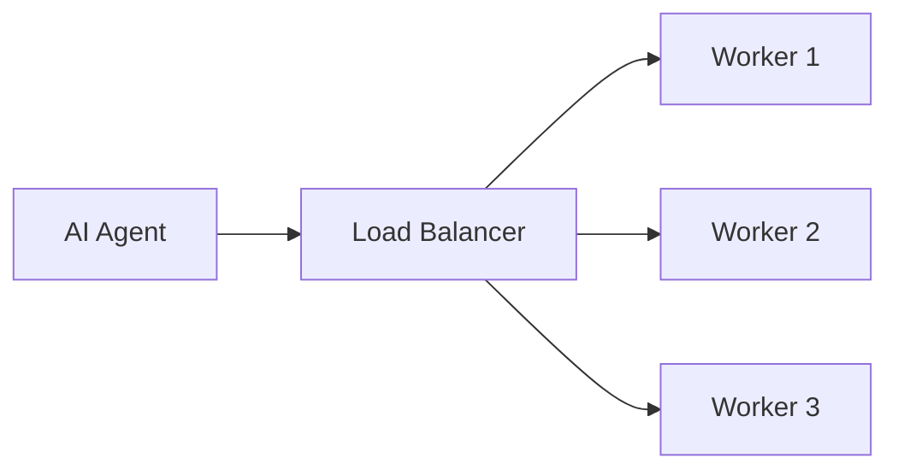
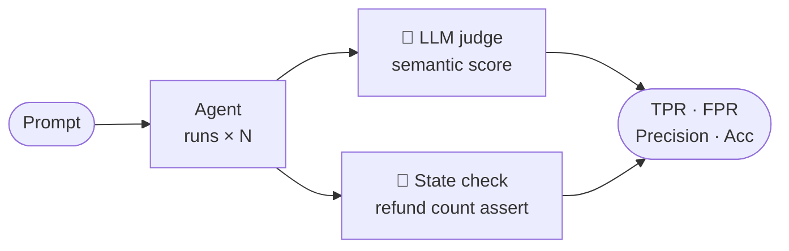

# Building robust MCP servers with Python and FastMCP
## API architecture for model consumers.

<div class="mt-12">
  Vladyslav Fedoriuk
</div>

<!--
Welcome. The goal of this talk is simple: you will leave with a proven mental model and an actionable checklist for deploying production-ready MCP servers safely.
-->

<style>
:global(#slide-content),
:global(.slidev-layout) {
  padding-left: 4rem !important;
  padding-right: 4rem !important;
  padding-bottom: 2.5rem !important;
}
:global(.cover) {
  padding-left: 4rem !important;
  padding-right: 4rem !important;
}
</style>

---
layout: default
---

# MCP Servers Are APIs for Models

<div class="grid grid-cols-2 gap-12 mt-4">
<div>

Each generation solved a different design problem:

<v-clicks>

- **REST** — resource-centric CRUD; client knows the URL tree; server owns state
- **GraphQL** — schema-first; one endpoint, introspectable; unifies queries, mutations, subscriptions under a typed contract
- **MCP** — same philosophy, broader primitives: **tools** (actions), **resources** (data), **prompts** (templates); consumer is a **model** that introspects and decides at runtime — not a developer writing queries

</v-clicks>

<v-click>

`/mcp` is a convention. The endpoint is yours to name — what sits behind it is JSON-RPC 2.0 over plain HTTP.

</v-click>

</div>
<div>

```http
POST /mcp HTTP/1.1
Content-Type: application/json
Accept: application/json, text/event-stream
MCP-Protocol-Version: 2025-11-25

{
  "jsonrpc": "2.0",
  "id": 1,
  "method": "tools/call",
  "params": {
    "name": "search_customers",
    "arguments": { "query": "John Doe" }
  }
}
```

</div>
</div>

<!--
No protocol magic here. It is a plain HTTP POST. The body is JSON-RPC 2.0. The path can be /api/mcp, /v1/mcp, or anything — /mcp is just the convention the community settled on. The only real change from REST or GraphQL is who is on the other end: a model, not a human-written client. That single shift is what makes architecture matter so much more.
-->

---
layout: section
---

# Make FastMCP Feel Like FastAPI/Flask


---
layout: two-cols
---

# The App Factory Pattern

<div style="zoom: 0.85">

```python {none|1|5-6|8}
def create_app(auth: AuthProvider) -> FastMCP:
    app = FastMCP(
        name="production-server",
        auth=auth,
        mask_error_details=True,
        on_duplicate="error",
    )
    app.apply_middleware(McpRequestCorrelationMiddleware())
    return app
```

</div>

::right::

<div class="text-sm flex flex-col gap-3 pl-8 pt-10">

<v-click at="1">

**Dependencies as arguments** — auth, clients, feature flags flow in as constructor args; swap them for fakes in tests without touching any business logic.

</v-click>

<v-click at="2">

**Fail at startup, not runtime** — `on_duplicate="error"` catches duplicate registrations on boot; `mask_error_details=True` keeps stack traces and internals away from the model.

</v-click>

<v-click at="3">

**Middleware for cross-cutting concerns** — correlation IDs, tracing, logging, rate limiting — wired once here, applied to every tool call automatically.

</v-click>

</div>

<!--
Core assertion: "FastMCP projects should use familiar web-app structure, not one giant decorator file."

What belongs in the factory: register tools, resources, prompts, and middleware; configure auth and security-sensitive behaviour; wire clients, repositories, feature flags, and settings; keep import-time side effects out of modules entirely.

Version caveat: some FastMCP versions use on_duplicate_tools / on_duplicate_resources / on_duplicate_prompts as separate flags. Current docs also describe global on_duplicate — check your version.
-->

---
layout: two-cols
---

# Auth Is Just Another Dependency

<div style="zoom: 0.8;">

````md magic-move
```python
# Traditional providers (GitHub, Google, Azure)
create_app(auth=OAuthProxy(
    client_id="...",
    client_secret="...",
    authorization_url="https://github.com/login/oauth/authorize",
    token_url="https://github.com/login/oauth/access_token",
    base_url="https://api.yourco.com",
))
```
```python
# DCR-capable providers (WorkOS, Descope)
create_app(auth=RemoteAuthProvider(
    token_verifier=JWTVerifier(
        jwks_uri="https://idp.co/jwks.json",
        issuer="https://idp.co",
    ),
    authorization_servers=["https://idp.co"],
    base_url="https://api.yourco.com",
))
```
```python
# Tests & local dev
create_app(auth=StaticTokenVerifier(
    tokens={
        "dev-alice-token": {
            "client_id": "alice@example.com",
            "scopes": ["read:data", "write:data"],
        },
    },
    required_scopes=["read:data"],
))
# Authorization: Bearer dev-alice-token
```
````

</div>

::right::

<div class="text-sm flex flex-col gap-3 pl-8 pt-10">

**`OAuthProxy`** — bridges traditional OAuth providers (GitHub, Google, Azure) that don't support DCR. Fixed client credentials, same MCP auth protocol on the outside.

<v-click at="1">

**`RemoteAuthProvider`** — for DCR-capable IdPs (WorkOS, Descope). Clients self-register dynamically; tokens validated against JWKS.

</v-click>

<v-click at="2">

**`StaticTokenVerifier`** — bearer tokens map directly to claims. Real scope checks, no OAuth server. Use in tests and local dev. Never in production.

</v-click>

</div>

<!--
The key point: swapping auth never touches tools, resources, or business logic. The factory is the only seam. In production you pass RemoteAuthProvider or OAuthProxy; in CI you pass StaticTokenVerifier. The tools don't know the difference.

StaticTokenVerifier stores tokens in plain text — never use in production.
-->


---
layout: two-cols
---

# Mount FastMCP as an ASGI Sub-App

<div class="text-sm flex flex-col gap-4 pr-4 pt-2">

`fastmcp_app.http_app()` returns a Starlette ASGI app — mount it inside your FastAPI app like any other sub-application.

**`stateless_http=True`** — each request gets a fresh transport context. No session affinity, no sticky sessions. Every worker is identical.

**`combine_lifespans`** — the MCP lifespan must not be dropped. Dropping it leaves the Streamable HTTP session manager uninitialized.

Choose `mount_prefix` and `mcp_path` deliberately — avoid accidentally creating `/mcp/mcp`.

</div>

::right::

<div class="pl-6 flex flex-col gap-4 justify-center h-full">



<div style="zoom: 0.7">

```python
def create_app(
    fastmcp_app: FastMCP,
    lifespan: Lifespan[FastAPI],
    mount_prefix: str = "",
    mcp_path: str = "/mcp",
) -> FastAPI:
    http_app = fastmcp_app.http_app(path=mcp_path, stateless_http=True)
    fastapi_app = FastAPI(
        lifespan=combine_lifespans(lifespan, http_app.lifespan)
    )
    fastapi_app.mount(mount_prefix, http_app)
    return fastapi_app
```

</div>

</div>

<!--
stateless_http=True eliminates SSE session state. Every worker is identical — standard load balancer, no sticky sessions. The FastAPI factory owns the lifespan wiring: drop http_app.lifespan and the Streamable HTTP session manager never initializes.
-->

---
layout: two-cols
---

# ASGI Wiring Details

<div class="text-sm flex flex-col gap-5 pr-4 pt-2">

**`http_app()` exposes a `.lifespan` property** — a `StarletteWithLifespan` subclass that surfaces the router's lifespan context. Pass it to `combine_lifespans` (covered on the previous slide).

**Auth discovery must live on the upstream app** — `.well-known` routes for protected resource metadata and authorization server discovery belong on the FastAPI app, not the mounted sub-app. The `mcp_path` here must match the public endpoint clients use.

</div>

::right::

<div class="pl-6 flex flex-col gap-4 justify-center h-full">

```python
class StarletteWithLifespan(Starlette):
    @property
    def lifespan(self) -> Lifespan[Starlette]:
        return self.router.lifespan_context
```


```python
router = fastapi.APIRouter(
    routes=list(
        fastmcp_app.auth.get_well_known_routes(
            mcp_path="/mcp"
        )
    )
)
fastapi_app.include_router(router)
```


</div>

<!--
One point: FastMCP integrates with normal ASGI architecture, so deployment, lifespan, auth discovery, observability, and middleware need deliberate web-app wiring. None of it is magic — it is the same plumbing you already know from FastAPI.
-->

---
layout: two-cols
---

# Feature Modules Don't Know FastMCP Exists

<div style="zoom: 0.85">

```python {none|1-8|11-16|19-24}
# customers/tools.py — no FastMCP import
from fastmcp.dependencies import Depends

async def search_customers(
    query: CustomerSearchQuery,
    service: CustomerService = Depends(get_customer_service),
) -> CustomerSearchResult:
    return await service.search(query)


# mcp_app/tools.py — composition root
from fastmcp.tools import Tool
from customers.tools import search_customers

def register_tools(app: FastMCP) -> None:
    app.add_tool(Tool.from_function(search_customers))


# create_app — the app reaches into modules, not the other way
def create_app(auth: AuthProvider) -> FastMCP:
    app = FastMCP(...)
    register_tools(app)      # app pulls from modules
    register_resources(app)
    return app
```

</div>

::right::

<div class="text-sm flex flex-col gap-3 pl-8 pt-10">

**Dependency direction flows inward** — feature modules never import the app; the app imports modules and wires them.

<v-click at="1">

**`Depends(...)` stays in the module** — FastMCP resolves it at call time; dependency parameters are excluded from the client-visible MCP schema.

</v-click>

<v-click at="2">

**Registration is explicit and central** — duplicate failures and ordering are visible in one place; tests can call the function directly or the registered tool.

</v-click>

<v-click at="3">

**The app reaches into modules — not the other way around** — modules are decoupled from the app and don't care how registration works. Their job is to define tools.

</v-click>

</div>

<!--
Decorators are fine for small demos; Tool.from_function + add_tool scales better when tools are spread across modules and packages.
-->

---
layout: two-cols
---

# Pydantic Models Are the Contract the Model Sees

<div style="zoom: 0.65">

```python {none|1-9|12-20|23-28}
class CreateCustomerInput(BaseModel):
    model_config = ConfigDict(frozen=True, extra="forbid", str_strip_whitespace=True)

    email: EmailStr
    display_name: Annotated[str, Field(min_length=2, max_length=80)]
    country: CountryAlpha2
    preferred_currency: Currency
    preferred_language: LanguageAlpha2 = "en"
    timezone: TimeZoneName


class CustomerCreated(BaseModel):
    model_config = ConfigDict(frozen=True, extra="forbid", from_attributes=True)

    customer_id: CustomerId   # Annotated[str, AfterValidator(format_customer_id)]
    email: EmailStr
    display_name: str
    country: CountryAlpha2
    preferred_currency: Currency
    status: Literal["active"]


async def create_customer(
    input: CreateCustomerInput,
    service: CustomerService = Depends(get_customer_service),
) -> CustomerCreated:
    dto = await service.create_customer(input.as_dto())
    return CustomerCreated.model_validate(dto, from_attributes=True)
```

</div>

::right::

<div class="text-sm flex flex-col gap-3 pl-8 pt-10">

<v-click at="1">

**Input is the model's API** — semantic types (`EmailStr`, `CountryAlpha2`, `Currency`) over plain strings; `extra="forbid"` + `frozen=True` harden the boundary.

</v-click>

<v-click at="2">

**Output is a server guarantee** — `model_validate(dto)` catches service-layer drift before FastMCP serializes; the server owns the failure.

</v-click>

<v-click at="3">

**Tools stay thin** — validate in, inject deps, validate out. Business logic belongs in the service layer.

</v-click>

</div>

<!--
If the tool returns a DTO directly and output validation fails inside FastMCP, the model may only see a ToolError with validation details. Explicit model_validate at the boundary gives you a clear place to log and debug before the error propagates.

Field descriptions, constraints, and return schemas are part of the public API contract — they appear in the tool schema the model introspects.
-->

---
layout: two-cols
---

# Domain Errors Must Become Intentional `ToolError`s

<div style="zoom: 0.72">

```python {none|1-3|6-16|19-25}
@attrs.frozen
class DuplicateCustomerEmailError(Exception):
    email: EmailStr


@contextlib.contextmanager
def map_tool_errors():
    try:
        yield
    except DuplicateCustomerEmailError as e:
        with logger.contextualize(email_hash=hash_email(e.email)):
            logger.exception("Duplicate customer email")
        raise ToolError("A customer with this email already exists.") from e
    except Exception as e:
        logger.exception("Unexpected tool error")
        raise ToolError("Unknown error occurred.") from e


async def create_customer(
    input: CreateCustomerInput,
    service: CustomerService = Depends(get_customer_service),
) -> CustomerCreated:
    with map_tool_errors():
        dto = await service.create_customer(input.as_dto())
        return CustomerCreated.model_validate(dto, from_attributes=True)
```

</div>

::right::

<div class="text-sm flex flex-col gap-3 pl-8 pt-10">

**FastAPI gap** — FastAPI has `app.exception_handler()`; FastMCP has no equivalent. Error conversion is your responsibility.

<v-click at="1">

**`mask_error_details=True` is not enough** — generic masked errors aren't actionable. Expected domain failures need explicit conversion to safe `ToolError` messages.

</v-click>

<v-click at="2">

**`map_tool_errors`** — domain errors become safe messages with structured log context; generic exceptions get one safe fallback. No stack trace reaches the model.

</v-click>

<v-click at="3">

**Scale it up with `singledispatch` or a registry** — map error types to handlers and you have your own `fastmcp_app.error_handler(...)`.

</v-click>

</div>

<!--
FastMCP has no app.exception_handler() equivalent like FastAPI. This context-manager pattern fills the gap and can evolve into a functools.singledispatch registry for larger servers.
-->

---
layout: two-cols
---

# `Depends` Alone Is Not Enough — Use a Registry

<div style="zoom: 0.66">

```python {none|1-5|8-15|18-30}
# dependency provider — resolves from svcs registry
async def get_customer_service(
    svcs_container: svcs.Container = Depends(get_svcs_container),
) -> CustomerService:
    return await svcs_container.aget(CustomerService)


# tool — unchanged, no awareness of the registry
async def create_customer(
    input: CreateCustomerInput,
    service: CustomerService = Depends(get_customer_service),
) -> CustomerCreated:
    with map_tool_errors():
        dto = await service.create_customer(input.as_dto())
        return CustomerCreated.model_validate(dto, from_attributes=True)


# test — swap real service for a fake via the registry
async def test_create_customer(
    mcp_client: fastmcp.Client,
    registry: svcs.Registry,
) -> None:
    fake = FakeCustomerService(customer_id="CUS-123-456")
    registry.register_value(CustomerService, fake)

    result = await mcp_client.call_tool(
        "create_customer",
        {"email": "alice@example.com", "display_name": "Alice"},
    )
    assert result.structured_content["customer_id"] == "CUS-123-456"
```

</div>

::right::

<div class="text-sm flex flex-col gap-3 pl-8 pt-10">

**FastAPI gap** — FastAPI has `app.dependency_overrides`; FastMCP has no equivalent. `svcs` fills the gap.

<v-click at="1">

**Registry + container** — the registry declares how to build each service; the DI container resolves them at call time. Tools never touch either directly.

</v-click>

<v-click at="2">

**Tools stay decoupled** — same function signature, same `Depends` declaration; no test-specific branching.

</v-click>

<v-click at="3">

**Tests swap implementations** — `registry.register_value(CustomerService, fake)` replaces the real service for the entire call; evals run offline with no live dependencies.

</v-click>

</div>

<!--
Without a registry, overriding nested dependencies is painful. svcs gives back the testing superpower FastAPI provides via dependency_overrides.
-->

---
layout: section
---

# Strategic Tool Design

<!--
We've covered the structural and wiring patterns — factory, auth, ASGI, modules, Pydantic, error handling, dependency injection. Now let's look at the strategic layer: how you design the tool surface itself.
-->

---
layout: two-cols
---

# Design Top-Down From Workflows, Not APIs

Mapping every REST endpoint 1:1 to an MCP tool bloats the context window. The model burns reasoning space reading tool definitions instead of solving the problem.

<div class="mt-6 text-sm">

**The fix:** expose one workflow tool and let the server orchestrate the granular calls.

</div>

::right::

<div class="pl-6 flex flex-col gap-4 justify-center h-full text-sm">

<div class="border border-red-400/40 rounded-lg p-4 bg-red-500/5">
<div class="font-bold text-red-400 mb-2">1:1 mapping — context rot</div>

`get_user` · `get_invoice` · `list_line_items` · `check_policy` · `issue_refund` · `notify_customer`

<div class="text-xs text-gray-400 mt-2">6 tools to chain → frequent context-chaining failures</div>
</div>

<div class="border border-green-400/40 rounded-lg p-4 bg-green-500/5">
<div class="font-bold text-green-400 mb-2">Workflow tool — one intent</div>

`process_customer_refund(order_id, reason)`

<div class="text-xs text-gray-400 mt-2">Server orchestrates the 6 calls — model just expresses intent</div>
</div>

</div>

<!--
Design top-down from user workflows. If an LLM must call get_user, get_invoice, and issue_refund separately, it frequently fails on context chaining. Let the MCP server own the orchestration.
-->

---
layout: two-cols
---

# Fewer, Richer Tools Over Many Atomic Ones

<div class="text-sm flex flex-col gap-4 pr-4 pt-2">

**Consolidate CRUD sprawl** — instead of `insert`, `update`, `patch`, `batch_insert`… expose a single `upsert` with optional parameters. The model expresses intent; the server picks the right operation.

<v-click>

**Phase tools by agent intent** — don't surface all tools at once. The Square MCP Server groups tools into phases: discovery first, then planning, then execution. Each phase only exposes what the agent needs at that moment.

</v-click>

<v-click>

<span class="text-xs text-gray-400">Square MCP Server — <a href="https://github.com/square/square-mcp-server" class="underline">github.com/square/square-mcp-server</a></span>

</v-click>

</div>

::right::

<div class="pl-6 flex flex-col gap-3 justify-center h-full text-sm">

<div class="border border-red-400/40 rounded p-3 bg-red-500/5">
<div class="font-bold text-red-400 text-xs mb-1">Sprawl</div>
<code class="text-xs">insert · update · patch · batch_insert · upsert_if_exists · replace · soft_delete…</code>
</div>

<v-click at="1">

<div class="border border-green-400/40 rounded p-3 bg-green-500/5">
<div class="font-bold text-green-400 text-xs mb-1">Consolidated</div>
<code class="text-xs">upsert(record, conflict="merge" | "replace" | "skip")</code>
</div>

<div class="border border-blue-400/40 rounded p-3 bg-blue-500/5 mt-2">
<div class="font-bold text-blue-400 text-xs mb-2">Square MCP — 3 tools for all of Square's API</div>
<div class="text-xs flex flex-col gap-1">
  <span>🔍 <strong>discover:</strong> <code>get_service_info(service: "catalog")</code></span>
  <span>📋 <strong>prepare:</strong> <code>get_type_info(service: "catalog", method: "list")</code></span>
  <span>⚡ <strong>execute:</strong> <code>make_api_request(service: "catalog", method: "list")</code></span>
</div>
</div>

</v-click>

</div>

<!--
Guiding agents layer-by-layer prevents overwhelming them upfront while retaining flexibility. Square built their MCP server using exactly this strategy — discovery tools first, execution tools only when the agent has enough context.
-->

---
layout: two-cols
---

# Reads and Writes Are Different Tools

Mixing reads and writes in a single tool makes destructive operations ambiguous during exploration. Separate boundaries let you apply distinct authorization policies and let the model know what's safe to call freely.

::right::

<div class="pl-6 flex flex-col gap-4 justify-center h-full text-sm">

<div class="border border-blue-400/40 rounded-lg p-4 bg-blue-500/5">
<div class="font-bold text-blue-400 mb-2">Read tools — safe to explore</div>
<div class="text-xs text-gray-400 mb-2">Authorization: <strong>Always Allow</strong></div>
<code class="text-xs">search_customers · get_invoice · list_orders</code>
<p class="text-xs text-gray-400 mt-2">Model can call freely during discovery. No consent required, no side effects.</p>
</div>

<div class="border border-red-400/40 rounded-lg p-4 bg-red-500/5">
<div class="font-bold text-red-400 mb-2">Write tools — explicit intent required</div>
<div class="text-xs text-gray-400 mb-2">Authorization: <strong>Require Consent</strong></div>
<code class="text-xs">process_refund · cancel_order · delete_customer</code>
<p class="text-xs text-gray-400 mt-2">Named to signal destructive intent. Consent gate prevents accidental modification during exploration.</p>
</div>

</div>

<!--
Mixing read and modify behaviors creates unpredictable AI interactions during exploration. Clean CQRS boundaries let authorization policies match the actual risk of each operation.
-->

---
layout: two-cols
---

# Tool Descriptions Are Prompts

<div style="zoom: 0.78">

````md magic-move
```python
# ❌ vague — model guesses, retries, hallucinates
app.add_tool(Tool.from_function(
    fn=create_customer,
    description="Creates a customer.",
))
```
```python
# ✅ instructional — model knows exactly what to do and what to expect
app.add_tool(Tool.from_function(
    fn=create_customer,
    description=(
        "Create a new customer account. "
        "Provide a valid email, display name (2–80 chars), "
        "ISO country code (e.g. US, DE), currency (e.g. USD, EUR), "
        "and IANA timezone (e.g. America/New_York). "
        "Returns the assigned customer_id and account status. "
        "IMPORTANT: confirm customer_id with the user before "
        "calling any write tools on this account."
    ),
))
```
````

</div>

::right::

<div class="text-sm flex flex-col gap-3 pl-8 pt-10">

**Descriptions are the model's only guide** — no docs, no tooltips, no autocomplete. If the description is vague, the model guesses.

<v-click at="1">

**Be instructional, not declarative** — state expected values, formats, and constraints. The model reads this as a prompt, not documentation.

</v-click>

<v-click at="1">

**Embed next-step hints** — tell the model what to do with the output (`confirm customer_id before any writes`). Prevents exploration from accidentally triggering destructive tools.

</v-click>

</div>

<!--
A well-written description prevents endless retry loops. If a tool can fail in a recoverable way, say so explicitly: "If duplicate email error is returned, call search_customers first to retrieve the existing record."
-->

---
layout: default
---

# Embed Prompting Hints Directly in the Schema

<div class="grid grid-cols-[2fr_1fr] gap-8 mt-4 h-full">
<div style="zoom: 0.72">

```python {none|1-7|8-17|19-27}
class ProcessRefundInput(BaseModel):
    model_config = ConfigDict(
        json_schema_extra={
            "description": (
                "Executes a complete refund workflow: "
                "lookup, policy check, refund, and email."
            ),
            "examples": [
                {
                    "customer_id": "CUS-123-456",
                    "invoice_id": "INV-2024-88",
                    "reason": "service_outage",
                    "full_refund": True,
                }
            ],
        }
    )

    customer_id: str = Field(description="Target customer formatted as CUS-XXX-XXX.")
    invoice_id: str = Field(description="The transaction to refund.")
    reason: Literal["service_outage", "billing_error", "dissatisfied"] = Field(
        description="Categorized reason. Strictly required for accounting audits."
    )
    full_refund: bool = Field(
        default=True,
        description="Set to false to issue a prorated refund. Default: true.",
    )
```

</div>
<div class="text-xs flex flex-col gap-2 pt-2">

<v-click at="1">

**`description` in `json_schema_extra`** — tool description lives alongside the examples; the model sees the full workflow intent without needing to know the steps.

</v-click>

<v-click at="2">

**`json_schema_extra.examples`** — few-shot examples in the JSON schema. The model sees them during introspection and learns the expected input shape without trial and error.

</v-click>

<v-click at="3">

**Fields are micro-prompts** — `Literal` enums constrain values; `Field(description=...)` explains format. Every constraint reduces hallucination surface.

</v-click>

</div>
</div>

<!--
The server orchestrates multiple APIs behind this one tool, preventing LLM chaining failures. Few-shot examples are critical here — small wording and example changes can dramatically shift model behavior.
-->

---
layout: two-cols
---

# Tool Selection Is a Classification Problem

A refund workflow eval scored **60% pass rate**. Fixing tool descriptions only — no code changes — brought it to **100%**.

<div class="mt-5 text-xs flex flex-col gap-2.5">

<div><span class="font-bold text-blue-400">Accuracy</span> <span class="text-gray-400 font-mono">passes / total runs</span> — overall health.</div>
<div><span class="font-bold text-green-400">TPR / Recall</span> <span class="text-gray-400 font-mono">correct / expected</span> — discoverability. Low TPR = model skips the tool entirely.</div>
<div><span class="font-bold text-red-400">FPR</span> <span class="text-gray-400 font-mono">wrong calls / not expected</span> — over-triggering. Tool bleeds into unrelated intents.</div>
<div><span class="font-bold text-yellow-400">Precision</span> <span class="text-gray-400 font-mono">correct / all calls</span> — correct usage ratio. Low = confused with sibling tools.</div>

</div>

::right::

<div class="pl-4 flex flex-col gap-3 justify-center h-full">

<div class="text-xs text-gray-400 mb-1">Confusion matrix — reveals which tools battle for the model's attention</div>

<table class="w-full text-xs text-center border-collapse">
  <thead>
    <tr>
      <th class="text-gray-500 p-2 text-left font-normal text-[10px]">called ↓ · expected →</th>
      <th class="text-gray-300 p-2 font-mono font-normal">search_customers</th>
      <th class="text-gray-300 p-2 font-mono font-normal">get_invoice</th>
      <th class="text-gray-300 p-2 font-mono font-normal">process_refund</th>
    </tr>
  </thead>
  <tbody>
    <tr>
      <td class="text-gray-400 text-left p-2 font-mono text-[10px]">search_customers</td>
      <td class="bg-green-500/40 text-green-100 p-2 rounded font-bold">18</td>
      <td class="bg-red-500/25 text-red-300 p-2">1</td>
      <td class="bg-red-500/25 text-red-300 p-2">0</td>
    </tr>
    <tr>
      <td class="text-gray-400 text-left p-2 font-mono text-[10px]">get_invoice</td>
      <td class="bg-red-500/25 text-red-300 p-2">0</td>
      <td class="bg-green-500/40 text-green-100 p-2 rounded font-bold">14</td>
      <td class="bg-yellow-500/40 text-yellow-100 p-2 font-bold">5</td>
    </tr>
    <tr>
      <td class="text-gray-400 text-left p-2 font-mono text-[10px]">process_refund</td>
      <td class="bg-red-500/25 text-red-300 p-2">0</td>
      <td class="bg-yellow-500/40 text-yellow-100 p-2 font-bold">4</td>
      <td class="bg-green-500/40 text-green-100 p-2 rounded font-bold">11</td>
    </tr>
  </tbody>
</table>

<div class="text-[10px] text-gray-400 mt-1"><code>get_invoice</code> and <code>process_refund</code> are confused — both involve an invoice. Fix: tighten descriptions to separate lookup intent from write intent.</div>

</div>

<!--
MCPJam: tool ergonomics as a measurable discipline. Small wording changes can dramatically shift LLM behavior.
Run evals across multiple models — Claude, GPT-4o, Gemini. A tool with high TPR on one model may be invisible to another. Cross-model performance is part of production readiness.
-->

---
layout: two-cols
---

# One Run Is Not a Signal — Use Two Scorers and Many Trials

<div class="text-xs flex flex-col gap-2 pr-6 pt-2">

**LLM judge** — scores semantic equivalence; handles non-deterministic phrasing. **State check** — hard pass/fail, no LLM: assert `fake_service.refunds_issued == 0` after a read-only scenario.

<v-click>

**Run × N** — A single run is noise; a pass rate is a signal.

</v-click>

<v-click>

**Assert argument correctness** — did the model pass `customer_id=CUS-123-456`, or hallucinate a value not in context?

</v-click>

<v-click>

**Read the transcripts** — graders miss unsafe paths. Correct final state ≠ correct behavior.

</v-click>

</div>

::right::

<div class="pl-4 flex flex-col gap-4 justify-center h-full">



</div>

<!--
GitHub three-stage cycle: Fulfillment → Evaluation → Summarization. F1-score aggregated across thousands of runs.
Cross-model coverage: your server serves Claude, GPT-4o, and Gemini simultaneously. Low TPR on one model is a production issue.
-->

---
layout: default
---

# Isolate What You Are Measuring: Descriptions and Reasoning

<div class="grid grid-cols-[2fr_1fr] gap-8 mt-4">
<div style="zoom: 0.6">

```python {none|1-9|11-13|14-32}
# 1. inject fake facade via svcs — same as unit tests
registry = svcs.Registry()
fake_service = FakeCustomerService()
fake_service.with_customer(customer_id="CUS-123-456", name="John Doe")
fake_service.with_invoice(
    invoice_id="INV-2024-88", customer_id="CUS-123-456", amount=100.0
)
registry.register_value(CustomerService, fake_service)
fastmcp_app = create_app(registry=registry)

# 2. wrap in FastMCPToolset — in-process, no HTTP
toolset = FastMCPToolset(fastmcp_app)
agent = Agent(model="openai:gpt-4o", toolsets=[toolset])

# 3. assert tool selection AND argument correctness
case = Case(
    input="Refund John Doe for the recent outage. Invoice INV-2024-88.",
    expected_tools=[
        ToolCall(
            name="search_customers",
            args={"query": "John Doe"},
        ),
        ToolCall(
            name="process_customer_refund",
            args={
                "customer_id": "CUS-123-456",  # ← extracted, not hallucinated
                "invoice_id": "INV-2024-88",
                "reason": "service_outage",
            },
        ),
    ],
)
```

</div>
<div class="text-xs flex flex-col gap-2 pt-1">

**Fake facades** — deterministic, cheap, no side effects. Measure descriptions and reasoning, not the network.

<v-click at="1">

**Controlled world** — the agent sees only what the facade exposes. Removes ambiguity about which tool to call.

</v-click>

<v-click at="2">

**pydantic-ai + FastMCP** — pass a server instance or a `Client`. No adapter layer.

</v-click>

<v-click at="3">

**Assert argument extraction** — `customer_id` must come from the search result, not the prompt. That's the reasoning you're measuring.

</v-click>

</div>
</div>

<!--
Neon's key insight: isolate what you are measuring — tool descriptions and LLM reasoning, not the network or the database.
Same svcs pattern used in unit tests — no new concept to learn, just a different assertion at the end.
-->

---
layout: cover
---

# Thank You

<div class="mt-10 text-sm text-gray-400">
  Vladyslav Fedoriuk
</div>