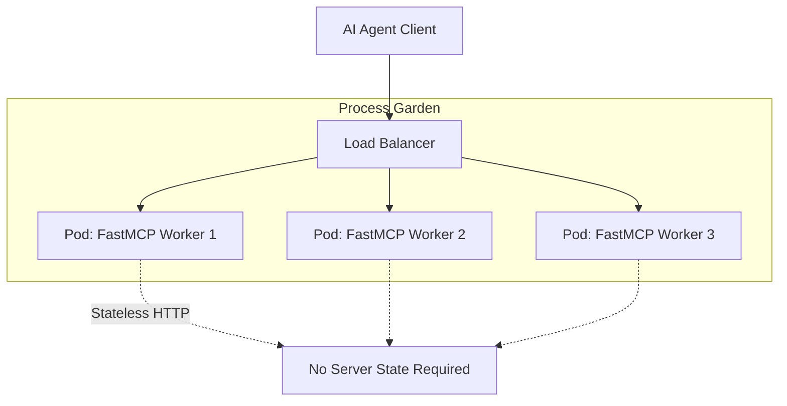
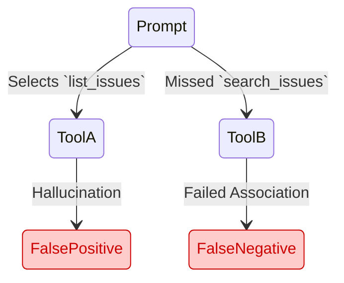

# Building robust MCP servers with Python and FastMCP
## API architecture for model consumers.

<div class="mt-12">
  Vladyslav Fedoriuk
</div>

<!--
Welcome. The goal of this talk is simple: you will leave with a proven mental model and an actionable checklist for deploying production-ready MCP servers safely.
-->

---
layout: default
---

# MCP Servers Are APIs for Models

* "Remote MCP servers are APIs where the primary consumer is a model, not a human app."
* Paradigm Shift: `HTTP -> JSON-RPC -> Server Tools/Resources`

<div class="mt-8 flex justify-center">


</div>

<!--
Think of MCP like GraphQL. It provides one endpoint with structured operations and a typed contract. We aren't going to get bogged down in protocol byte-details today; we are focusing on architecture.
-->

---
layout: default
---

# Make FastMCP Feel Like FastAPI

* "Avoid global giant decorators. Use an App Factory pattern for safe scaling."
* Centralize: Middleware, Auth, Duplicate policies (`on_duplicate="error"`), and error masking.

<div class="mt-8">

````md magic-move
```python
# 1. Start with an App Factory
from fastmcp import FastMCP
from mcp_app.tools import register_tools

def create_app(auth: AuthProvider) -> FastMCP:
    app = FastMCP(
        name="production-server",
        auth=auth,
        mask_error_details=True,
        on_duplicate="error",
    )
    app.apply_middleware(McpRequestCorrelationMiddleware())
    register_tools(app)
    return app
```
```python
# 2. Mount it as an ASGI Sub-App
from fastapi import FastAPI

def create_app(
    fastmcp_app: FastMCP,
    lifespan: Lifespan[FastAPI],
) -> FastAPI:
    # stateless_http=True eliminates session affinity requirements
    http_app = fastmcp_app.http_app(path="/mcp", stateless_http=True)
    
    # Critical: Combine lifespans!
    api = FastAPI(lifespan=combine_lifespans(lifespan, http_app.lifespan))
    
    # Mount discovery routes for authorization
    api.include_router(APIRouter(routes=list(fastmcp_app.auth.get_well_known_routes())))
    api.mount("", http_app)
    return api
```
````

</div>

<!--
[click] Global decorators are fine for demos but fail in production. An App Factory lets you inject dependencies safely, set up test environments easily, and enforce security policies like masked errors globally.

[click] The biggest gotcha when scaling MCP is state. Notice stateless_http=True—this ensures requests don't require session affinity when placed behind a load balancer. Also, exposing .well-known routes is required for OAuth metadata discovery.
-->

---
layout: default
---

# Deploying with a Process Garden

* `stateless_http=True` avoids session affinity requirements in horizontally scaled deployments.
* `mcp.http_app()` returns a Starlette app with a lifespan hook.

<div class="mt-8 flex justify-center">



</div>

<!--
By eliminating the SSE state dependency, you can safely deploy multiple instances of your MCP server behind a standard load balancer.
-->

---
layout: default
---

# Separate Tool Definitions From Registration

* "Aggregate tools at the app-level; don't bake FastMCP into your domain logic."

<div class="mt-8">

```python
# customers/tools.py (No FastMCP app import!)
async def search_customers(query: str, service = Depends(get_service)):
    return await service.search(query)
```

```python
# mcp_app/tools.py (Composition Root)
from fastmcp.tools import Tool
from customers.tools import search_customers

def register_tools(app: FastMCP) -> None:
    app.add_tool(Tool.from_function(search_customers))
```

</div>

<!--
This dependency inversion keeps your feature modules clean. They don't need to know FastMCP exists, making them significantly easier to test and reuse elsewhere in your codebase.
-->

---
layout: default
---

# Pydantic & Error Boundaries

* "Tool input/output Pydantic models are the strict contract the LLM sees."
* **Centralized Errors**: Masked errors hide internals safely; map them to actionable messages.

<div class="mt-4">

````md magic-move
```python
# 1. Pydantic Boundary
class CreateCustomerInput(BaseModel):
    model_config = ConfigDict(frozen=True, extra="forbid")
    email: EmailStr
    country: CountryAlpha2
    timezone: TimeZoneName

async def create_customer(input: CreateCustomerInput) -> CustomerCreated:
    dto = await service.create_customer(input)
    # Server owns the failure if mapping breaks!
    return CustomerCreated.model_validate(dto)
```
```python
# 2. Centralized Error Conversion Boundary
@contextlib.contextmanager
def map_tool_errors():
    try:
        yield
    except DuplicateCustomerError as e:
        logger.exception("Duplicate customer email")
        raise ToolError("A customer with this email already exists.") from e

async def create_customer(input: CreateCustomerInput) -> CustomerCreated:
    with map_tool_errors():
        dto = await service.create_customer(input)
        return CustomerCreated.model_validate(dto)
```
````

</div>

<!--
[click] If you rely on plain strings, the LLM will hallucinate invalid states. Tight Pydantic boundaries force the LLM to provide exact, validated constructs before your business logic even runs.

[click] FastMCP lacks a robust global exception handler like FastAPI's app.exception_handler. By centralizing conversions, we protect stack traces from the LLM while providing it clear recovery instructions.
-->

---
layout: default
---

# Use a Composition Root for Dependencies

* "FastMCP `Depends` is useful, but it requires a dedicated container like `svcs` for testability."
* It permits easy substitution of fake services during offline evaluations.

<div class="mt-8">

```python {1,4-5,9}
import svcs

# Resolving from the registry
async def get_customer_service(
    svcs_container: svcs.Container = Depends(get_svcs_container),
) -> CustomerService:
    return await svcs_container.aget(CustomerService)

# In tests or offline evals:
registry.register_value(CustomerService, FakeCustomerService())
```

</div>

<!--
Without a registry, overriding dependencies across nested architectures is painful. `svcs` gives us back the testing superpower FastAPI provides via `dependency_overrides`.
-->

---
layout: default
---

# Beyond 1:1 API Mapping

* "Mapping every REST endpoint 1:1 to an MCP tool creates cognitive overload."
* **Problem**: Chaining multiple tools (`get_user` -> `get_invoice` -> `issue_refund`) fails frequently due to context constraints.
* **Solution**: Expose workflow-level tools and orchestrate granular APIs server-side.

```mermaid
gantt
    title Context Window Usage
    dateFormat X
    axisFormat %s
    
    section API 1:1 (Bloated)
    Tool Definitions (Context Rot) : 0, 80
    Reasoning Space : 80, 100
    
    section Workflow Tools
    Compact Tool Definitions : 0, 20
    Reasoning Space : 20, 100
```

<div class="mt-8 flex justify-center transform scale-90">



</div>

<!--
The chart shows how bloating the prompt with too many atomic APIs steals cognitive reasoning space from the LLM. Design top-down from user workflows instead.
-->

---
layout: default
---

# Avoid Context Rot (Ogres with Layers)

* "Consolidate tool sprawl to save tokens and improve intent matching."

<v-clicks>

* **The Tactical Pattern**: Expose a single unified `upsert` tool rather than 18 CRUD variations (e.g. `insert`, `update`, `batch_insert`).
* **Progressive Disclosure**: "Ogres with layers"—start with discovery, move to planning, then execution.
* *One proven example: The Square MCP Server pattern.*

</v-clicks>

<!--
Guiding agents layer-by-layer prevents overwhelming them upfront while retaining flexibility. Explain how Square built their MCP using this exact strategy based on Block's playbook.
-->

---
layout: default
---

# Separate Read & Write Operations (CQRS)

* "Provide distinct, separate tools for reading data versus modifying state."

<div class="grid grid-cols-2 gap-4 mt-8">
<div class="bg-blue-500/10 p-4 rounded-lg border border-blue-500/30">

### Read Tools (Safe)
* High exploration
* Distinct Authorization Boundary: **"Always Allow"**
* Example: `search_customers`, `get_invoice`
</div>

<div class="bg-red-500/10 p-4 rounded-lg border border-red-500/30">

### Write Tools (Destructive)
* Explicitly clear to the LLM agent
* Distinct Authorization Boundary: **"Require Consent"**
* Example: `process_customer_refund`
</div>
</div>

<!--
Mixing read and modify behaviors creates unpredictable AI interactions during exploration. It makes destructive operations explicitly clear to the LLM agent, mitigating unintended modifications.
-->

---
layout: default
---

# Tool Descriptions are Prompts

* "Every tool description is a targeted prompt guiding LLM decision-making."
* **Actionable Errors:** Tell the LLM exactly how to recover.

<div class="mt-8">

````md magic-move
```python
# ❌ Vague Description
limit: int = Field(
    default=10, 
    description="Maximum results to return."
)
```
```python
# ✅ Instructional Prompt
limit: int = Field(
    default=10, 
    description="Default: 10. Max: 100. "
                "Use 10-20 for broad exploration. "
                "Use 50-100 when performing automated bulk operations."
)
```
````

</div>

<!--
[click] A well-written tool description prevents the LLM from falling into an endless retry loop. For example, explicitly output "File too large. Use pagination to retrieve further results."
-->

---
layout: default
---

# Leverage Pydantic for Complex Workflows

* "Embed LLM prompting and **few-shot examples** directly into JSON schemas."

<div class="mt-4">

```python {8-18}
from pydantic import BaseModel, ConfigDict, Field
from typing import Literal

class ProcessRefundInput(BaseModel):
    """Executes a complete refund workflow: lookup, policy check, stripe refund, and email."""

    model_config = ConfigDict(
        # Inject few-shot examples directly into the JSON schema
        json_schema_extra={
            "examples": [
                {
                    "customer_id": "CUS-123-456",
                    "invoice_id": "INV-2024-88",
                    "reason": "service_outage",
                    "full_refund": True,
                }
            ]
        }
    )
    # Fields omitted for brevity
```

</div>

<!--
The server orchestrates multiple APIs behind this one tool, preventing LLM chaining failures. Few-shot examples are critical here to train the LLM's parser on exactly what state combination is expected without manual trial and error.
-->

---
layout: default
---

# Knowing When Tools Fail

Offline evaluation treats tool selection as a **multi-label classification problem** to catch regressions safely.

<v-clicks>

* **Precision**: Did the model hallucinate calling this tool? *(False Positives highlight dangerously confusing tool descriptions)*
* **Recall**: Did the model miss calling it when expected? *(False Negatives highlight missing contextual associations)*

</v-clicks>

<div class="mt-8 flex justify-center transform scale-90">



</div>

<!--
Reference: Measuring what matters: How offline evaluation of GitHub MCP Server works. A confusion matrix reveals exactly which tools are battling for the LLM's attention, enabling precise description adjustments. For example, calling `delete_repo` when asked to simply `list_repos` drops precision.
-->

---
layout: default
---

# The Evaluation Pipeline

* "Automated model graders scale, but human transcript reviews catch behavioral regressions."

<div class="mt-8 mb-8 flex justify-center">


</div>

<v-clicks>

* **Argument Correctness**: Measure *Exact Value Matches* vs *Parameter Hallucinations* alongside basic tool selection.
* **The Tradeoff**: Balance **Hit Rate** (Tool Coverage) vs. **Success Rate** (Execution Reliability).

</v-clicks>

<div class="mt-8 text-xs opacity-60 absolute bottom-4">
Ref 1: Demystifying evals for AI agents (Anthropic)<br>
Ref 2: How to test MCP servers effectively (Merge.dev)
</div>

<!--
Transcripts reveal subtle behavioral regressions that automated graders easily miss.
Don't just trust automated graders. Look up and read the transcripts yourself. Tracking both Hit Rate and Success Rate tells you if your tool is undiscoverable by the LLM, or if it is discovered but fundamentally broken.
-->

---
layout: default
---

# Testing with Pydantic AI & Facades

* "Use the established `svcs` registry pattern to mock deterministic behavior."

<div class="mt-4">

```python {8-9,16-25}
from pydantic_ai import Agent
from pydantic_ai.toolsets.fastmcp import FastMCPToolset
from pydantic_evals import MCPEvalCase, ToolCall
import svcs

# 1. Inject a fake facade using the svcs registry
registry = svcs.Registry()
registry.register_value(CustomerService, FakeCustomerService())
fastmcp_app = create_app(registry=registry)

toolset = FastMCPToolset(fastmcp_app)
agent = Agent(model="openai:gpt-4o", toolsets=[toolset])

# 3. Benchmark multi-step reasoning and tool chaining
case = MCPEvalCase(
    input="Refund John Doe for the recent outage. His invoice is INV-2024-88.", 
    expected_tools=[
        ToolCall(name="search_customers", args={"query": "John Doe"}),
        ToolCall(
            name="process_customer_refund", 
            args={
                "customer_id": "CUS-123-456",  # Agent extracts this from search!
                "invoice_id": "INV-2024-88",
                "reason": "service_outage",
            }
        )
    ]
)
```

</div>

<!--
By mocking with svcs, we evaluate end-to-end AI reasoning flows and parameter hallucination without risking real production operations. This ensures our evals are perfectly deterministic, significantly cheaper, and incredibly fast.
-->